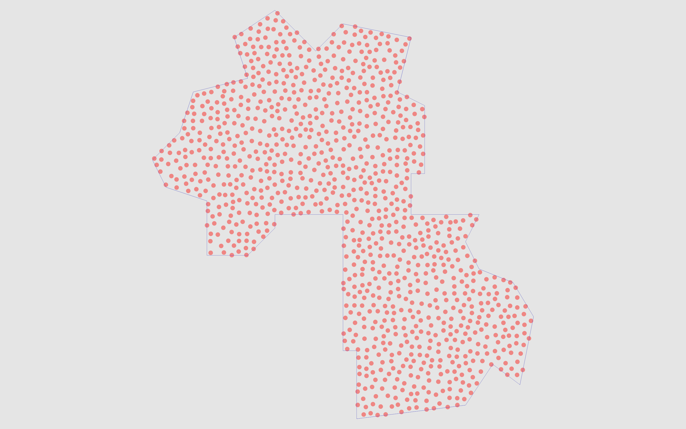

# PoPo

PoPo offers fast (Po)isson Disc Sampling for arbitrary (Po)lygons.

## Usage

```bash
cargo add popo
```

**Note**: The exposed API may change in future releases. Expect breaking changes until the v1.0.0 release.

### Filling a padded polygon with samples

```rust
use popo::poisson_disc_sampling::sample;
use popo::vectors::Vec2;

let polygon = vec![
    Vec2::new(0.0, 0.0),
    Vec2::new(1.0, 0.0),
    Vec2::new(1.0, 1.0),
    Vec2::new(0.0, 1.0),
];

let samples: Vec<Vec2> = sample(polygon, 0.1, 30, Some(0.01), None).collect();

assert!(!samples.is_empty());
println!("Generated {} samples", samples.len());
for point in samples {
    println!("{:?}", point);
}
```

### Generating a limited number of samples

The returned value is an iterator, so you can limit the number of samples generated by using `.take(n)`.

```rust
...
let samples: Vec<Vec2> = sample(polygon, 0.1, 30, Some(0.01), None).take(10).collect();
...
```

### Padding

| Positive (Inwards) padding | No padding | Negative (Outwards) padding |
| --------------- | --------------- | ---------- |
|  |  |  |

### How fast is it?

Currently, the library can generate around 100,000 samples in under 0.25 seconds,

- on a concave polygon [the one from the sample application](https://github.com/mirrajabi/popo/blob/bef78a0fb1b88c417cb01c8301840cb11c4f804b/src/main.rs#L21),
- on a 2023 MacBook Pro (16GB) with an M2 Pro chip,
- in release mode,

```text
Took: 246ms to generate 102889 samples
Took: 242ms to generate 102804 samples
Took: 235ms to generate 102714 samples
Took: 243ms to generate 102947 samples
Took: 241ms to generate 102873 samples
Took: 236ms to generate 102740 samples
Took: 234ms to generate 102960 samples
Took: 231ms to generate 102945 samples
Took: 236ms to generate 102771 samples
Took: 237ms to generate 102951 samples
```

As another example, it can generate around ~5000 samples on a simple square polygon in 10ms.

**Note**: In future, I would really like to make it use all available CPU cores to speed up the sampling process, but currently it is single-threaded.

### License

This project is dual-licensed under the MIT and Apache-2.0 licenses. You can choose either license for your use.
